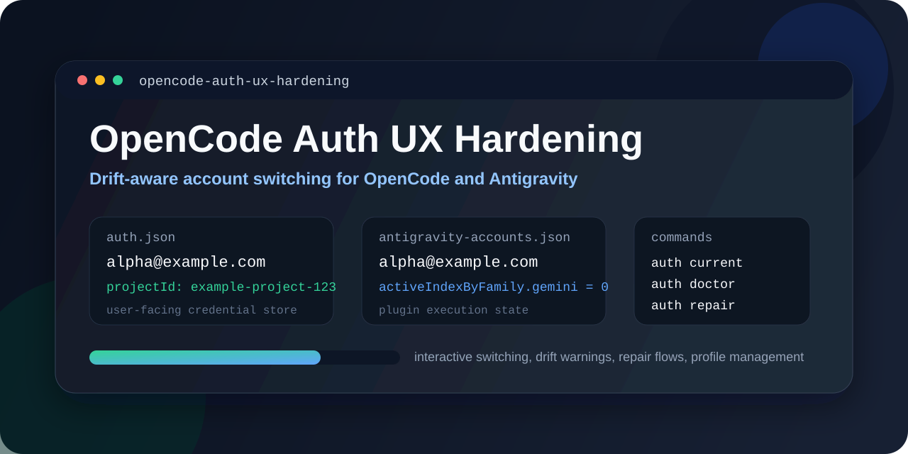

# Opencode Auth UX Hardening

Sanitized documentation, patch artifacts, and an installer for a hardened `opencode` launcher setup around `opencode-ai@1.14.31` plus the `opencode-antigravity-auth` plugin.

This repo now covers two connected UX problems:

- multi-store auth drift between `auth.json`, saved profiles, plugin state, and live runtime
- a static model picker that does not reflect real quota, cooldowns, or fallback readiness

The published patch keeps the auth tooling, then layers on a smarter picker that can surface quota-aware Google models, flash cooldown state, GLM fallbacks, and local gateway status without shipping any private tokens or machine-specific state. It also routes fresh launches toward the best currently-live model instead of blindly trusting stale session defaults.

## What Is Included

- a real launcher patch for `opencode-ai@1.14.31`
- smart model-picker logic driven by Antigravity quota and cooldown metadata
- a verified companion workflow for `opencode-antigravity-auth@1.6.5-beta.0`
- redacted examples for auth state, plugin config, and model-picker output
- upstream attribution and official reference links

## Problem

Two things were broken in practice:

1. Auth switching could drift across stores.
   - `auth.json` said one Google account was active.
   - the Antigravity store said another one was active.
   - live sessions could still be bound to older state.

2. The model picker felt dead.
   - quota-backed models looked identical to dead ones
   - flash models disappeared even though they would be usable again after reset
   - GLM and free fallbacks were not clearly separated from quota-backed models

The fix was to treat both auth and model choice as stateful systems, make those layers explicit, and keep the picker synced from real metadata instead of static labels.

## What Was Improved

| Area | What It Does | Example |
|---|---|---|
| Drift-aware auth commands | Adds `auth current`, `auth doctor`, `auth repair`, and sync-aware switching | `opencode auth current` |
| Interactive switching | Switches profiles by picker instead of forcing memorized names | `opencode auth switch` |
| Restart-aware runtime handling | Makes live rebinding explicit with `--restart` | `opencode auth switch personal --restart` |
| Smart model picker | Rewrites surfaced labels and favorites from real quota state | interactive `opencode` picker |
| Flash cooldown surfacing | Keeps flash models visible with exact model-cooldown labels until quota resets | `[WAIT model 6d 18h] Gemini 3 Flash Preview` |
| Smart launch routing | Computes the best live launch model instead of trusting stale session state | default `opencode` / `opencode run` |
| GLM and free fallback routing | Promotes free or non-Google paths when they are the best escape hatch | `glm-nvidia/glm-5.1`, `glm-puter/glm-5.1`, `opencode/gpt-5-nano` |
| Gateway status labeling | Marks local gateway models as live or offline instead of pretending they work | `[LOCAL OFFLINE] GLM-5.1 (Gateway)` |
| Plugin companion config | Tunes plugin runtime behavior to fit the launcher's smarter state model | `examples/state/antigravity.json` |

## Quick Examples

Auth state:

```powershell
opencode auth current
opencode auth doctor
opencode auth repair
opencode auth switch personal --restart
```

Picker state:

```text
Favorites

• [READY bucket 20%] Gemini 3.1 Pro (Antigravity) Google
  [READY bucket 20%] Gemini 3.1 Pro Google
  [READY bucket 100%] Gemini 2.5 Flash Google
  [WAIT model 6d 18h] Claude Sonnet 4.6 (Antigravity) Google
  [WAIT model 6d 18h] Gemini 3 Flash (Antigravity) Google
  [WAIT model 6d 18h] Gemini 3 Flash Preview Google
  [FREE GLM] GLM-5.1 (NVIDIA NIM)
  [FREE GLM] GLM-5.1 (Puter)
  [FREE FAST] GPT-5 Nano
  [FREE FAST] MiniMax M2.5 Free
```

Redacted sample outputs:

- [examples/output/auth-current.txt](examples/output/auth-current.txt)
- [examples/output/model-picker.txt](examples/output/model-picker.txt)

## Apply The Patch

Supported baseline:

- `opencode-ai@1.14.31`

Apply it to the detected global install:

```powershell
node scripts/apply-opencode-auth-ux-patch.mjs
```

Apply it to an explicit package root:

```powershell
node scripts/apply-opencode-auth-ux-patch.mjs --target "C:\Users\you\AppData\Roaming\npm\node_modules\opencode-ai"
```

Restore the original launcher:

```powershell
node scripts/apply-opencode-auth-ux-patch.mjs --restore
```

Review the exact delta before applying:

- [patches/opencode-ai-1.14.31-auth-ux.patch](patches/opencode-ai-1.14.31-auth-ux.patch)
- [vendor/upstream/opencode-ai/1.14.31/bin/opencode](vendor/upstream/opencode-ai/1.14.31/bin/opencode)
- [artifacts/opencode-ai/1.14.31/bin/opencode](artifacts/opencode-ai/1.14.31/bin/opencode)

Details:

- [docs/APPLY.md](docs/APPLY.md)
- [docs/ARCHITECTURE.md](docs/ARCHITECTURE.md)
- [docs/IMPROVEMENTS.md](docs/IMPROVEMENTS.md)

## Plugin Companion

The Antigravity package itself is not source-forked here. The verified plugin code remains upstream, but the working setup depends on two plugin-owned files:

- `antigravity-accounts.json` for quota, cooldown, active-family, and project metadata
- `antigravity.json` for runtime behavior that complements the launcher patch

That means the public repo is honest about scope:

- launcher patch: yes
- plugin code patch: no
- plugin runtime config companion: yes

Verify the installed plugin package:

```powershell
node scripts/verify-antigravity-plugin.mjs
```

Example companion state:

- [examples/state/antigravity-accounts.json](examples/state/antigravity-accounts.json)
- [examples/state/antigravity.json](examples/state/antigravity.json)
- [docs/PLUGIN.md](docs/PLUGIN.md)

## Repo Layout

- [scripts/apply-opencode-auth-ux-patch.mjs](scripts/apply-opencode-auth-ux-patch.mjs): applies or restores the patched launcher
- [scripts/verify-antigravity-plugin.mjs](scripts/verify-antigravity-plugin.mjs): verifies the installed Antigravity auth plugin matches the expected upstream package
- [patches/opencode-ai-1.14.31-auth-ux.patch](patches/opencode-ai-1.14.31-auth-ux.patch): unified diff from upstream `1.14.31` to the patched launcher
- [vendor/upstream/opencode-ai/1.14.31/bin/opencode](vendor/upstream/opencode-ai/1.14.31/bin/opencode): clean launcher from the npm tarball
- [artifacts/opencode-ai/1.14.31/bin/opencode](artifacts/opencode-ai/1.14.31/bin/opencode): patched launcher ready to install
- [docs/APPLY.md](docs/APPLY.md): apply, inspect, verify, and restore instructions
- [docs/PLUGIN.md](docs/PLUGIN.md): plugin-side scope, verification, and runtime companion config
- [docs/IMPROVEMENTS.md](docs/IMPROVEMENTS.md): exact user-facing changes and examples
- [docs/ARCHITECTURE.md](docs/ARCHITECTURE.md): auth stores, model-state flow, and refresh behavior
- [examples/state](examples/state): redacted auth and plugin state
- [examples/output](examples/output): redacted command and picker outputs
- [ATTRIBUTION.md](ATTRIBUTION.md): creator credit and official references

## Privacy

Everything in this repo is redacted:

- email addresses use placeholders like `alpha@example.com`
- project IDs are synthetic
- tokens are fake
- local paths use `<HOME>` or placeholder Windows paths
- example cooldowns and quota percentages are representative, not copied from a live account
- the published patch uses generic Python discovery instead of a machine-specific launcher path

See [docs/PRIVACY.md](docs/PRIVACY.md).

## Why This Approach

The auth side was checked against established patterns from:

- GitHub CLI multi-account auth
- Google Cloud CLI configurations
- 1Password CLI multiple accounts
- npm/Homebrew doctor-style diagnostics

The model-picker side follows the same philosophy:

- prefer explicit state over implied state
- preserve temporarily cooling-down models when they will become usable again
- surface cheap fallbacks before users hit a dead end
- separate package code from local runtime config

Details and links are in [docs/RESEARCH.md](docs/RESEARCH.md).

## Credit

Credit belongs to the upstream OpenCode and Antigravity auth plugin creators. This repo patches the launcher around their existing system, then documents the multi-store auth and model-state behavior clearly instead of rebranding it as original work.

- OpenCode: https://opencode.ai
- OpenCode GitHub: https://github.com/opencode-ai/opencode
- Antigravity auth plugin: https://github.com/NoeFabris/opencode-antigravity-auth

Full attribution is in [ATTRIBUTION.md](ATTRIBUTION.md).

## License

[MIT](LICENSE)
