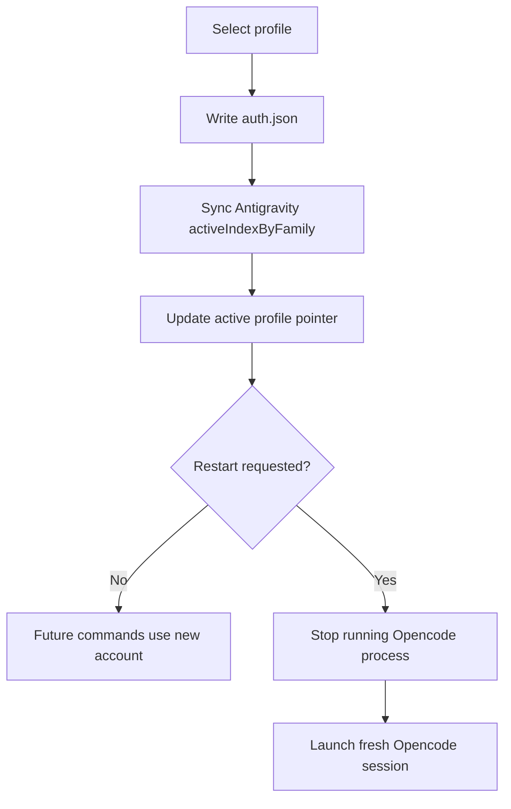

# Architecture

## Stores

This auth flow was treated as a four-layer system:

1. Local auth file
   - `<HOME>/.local/share/opencode/auth.json`
   - User-facing credential state

2. Saved profiles
   - `<HOME>/.local/share/opencode/auth.profiles.json`
   - Named snapshots for quick switching

3. Plugin account store
   - `<HOME>/.config/opencode/antigravity-accounts.json`
   - Execution-capable account state for the Antigravity auth plugin

4. Runtime session state
   - `<HOME>/.local/share/opencode/opencode.db`
   - Live sessions that may still be bound to an older account

## Core Rule

Changing one store is not enough.

The user experience only becomes coherent if these are checked together:

- profile selection
- `auth.json`
- Antigravity active family index
- live Opencode runtime

## Switching Model

## Repair Model

`opencode auth repair` intentionally fixes only cheap, high-confidence drift:

- sync Antigravity Gemini active account to the `auth.json` email
- backfill missing `projectId` from the Antigravity account store
- fix the active profile pointer when a saved profile already matches
- update saved profile metadata when repairable

It does not try to silently refresh tokens or mutate unrelated runtime state.

## Runtime Principle

A live session is not automatically the same thing as the newly selected default account.

That is why `--restart` exists:

- default account changes are cheap
- rebinding a live interactive process is not cheap
- the tool should make that boundary explicit
