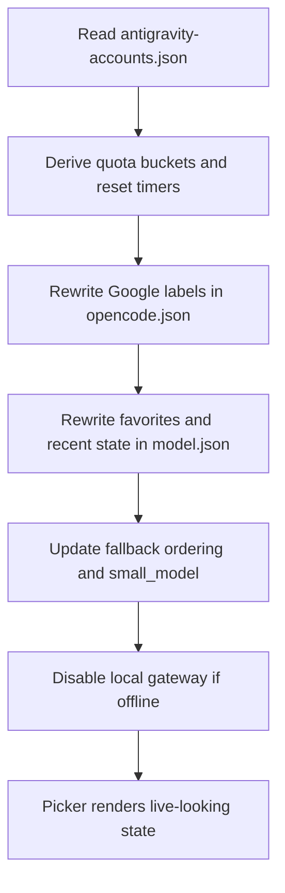

# Architecture

The patched setup treats both auth and model choice as layered state, not as a single toggle.

## State Layers

1. Local auth file
   - `<HOME>/.local/share/opencode/auth.json`
   - user-facing default credential state

2. Saved profiles
   - `<HOME>/.local/share/opencode/auth.profiles.json`
   - named snapshots for fast switching

3. Plugin account store
   - `<HOME>/.config/opencode/antigravity-accounts.json`
   - execution-capable Antigravity account state
   - active family selection
   - cached quota and cooldown metadata

4. Plugin runtime config
   - `<HOME>/.config/opencode/antigravity.json`
   - account selection strategy
   - recovery and retry behavior
   - rate-limit waiting policy

5. OpenCode config and picker state
   - `<HOME>/.config/opencode/opencode.json`
   - `<HOME>/.local/state/opencode/model.json`
   - surfaced providers, labels, favorites, and variants

6. Runtime session state
   - `<HOME>/.local/share/opencode/opencode.db`
   - live sessions that may still be bound to older auth or model defaults

## Core Rule

Changing one layer is not enough.

The user experience only becomes coherent if these are checked together:

- selected profile
- `auth.json`
- Antigravity active family index
- Antigravity quota and cooldown metadata
- OpenCode picker state
- live OpenCode runtime

## Auth Switching Model

## Model Refresh Model

## Smart Launch Routing

The launcher does not fully trust persisted default model state.

For real launches it can:

- read the active Antigravity account
- derive live versus waiting quota candidates
- choose the best currently-live primary model
- inject that model for startup instead of blindly trusting stale session state

Utility commands should not receive that injection. `opencode models` and similar non-launch commands should behave like upstream CLI surfaces.

## Repair Principle

`opencode auth repair` intentionally fixes only cheap, high-confidence drift:

- sync Antigravity active account to the `auth.json` email
- backfill missing `projectId` from the Antigravity store
- fix the active profile pointer when a saved profile already matches
- update saved profile metadata when repairable

It does not try to silently refresh tokens or mutate unrelated runtime state.

## Flash Quota Principle

A model being temporarily rate-limited is not the same thing as a dead model.

That is why the smarter picker keeps flash models visible:

- `READY` means the bucket is immediately usable
- `WAIT model ...` means the exact model path is cooling down
- a waiting flash model can still be the right favorite once the reset passes

This preserves future availability instead of hiding useful models just because they are temporarily cooling down.

## Runtime Principle

A live session is not automatically the same thing as newly written default state.

That is why the patch makes these boundaries explicit:

- default account changes are cheap
- model labels and favorites can be refreshed in place
- rebinding a live interactive process is not cheap
- gateway reachability and quota resets are dynamic, so interactive refresh keeps the picker from going stale
